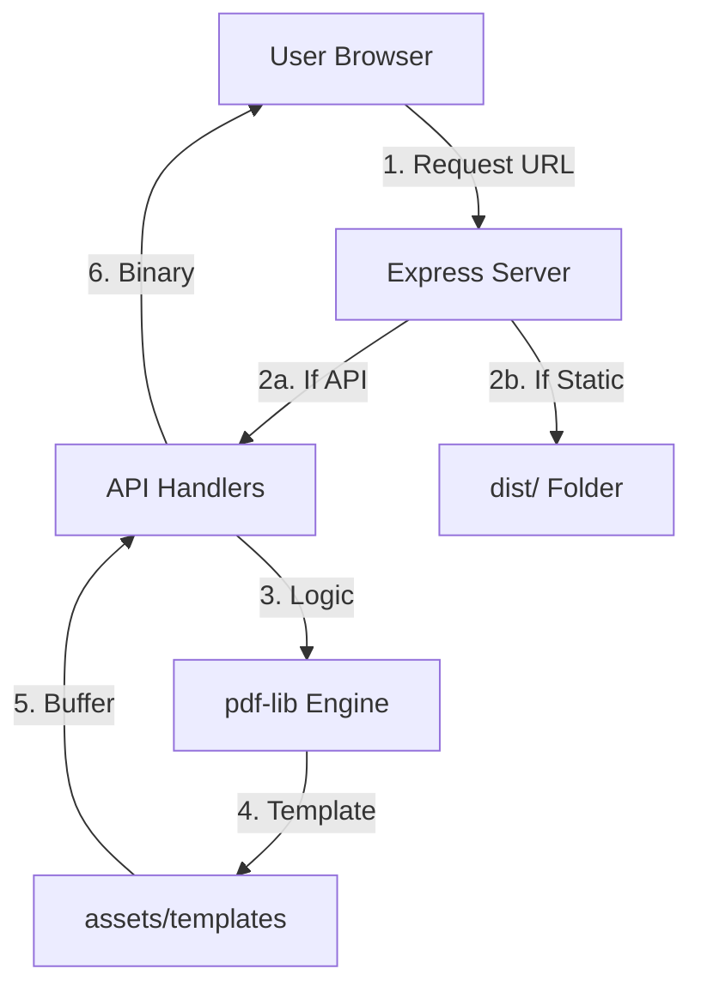

# JBCert Unified: How It Works

This document explains the internal logic and communication flow of the unified JBCert system.

## 🏗️ Unified Architecture
The system is now a **Single-Process Monolith**. A single Node.js instance serves both the API endpoints and the static React frontend files.

## 🔄 Core Logic Flows

### 1. The Serving Strategy
- **Development (`npm run dev`):** 
  - Uses `concurrently` to run two servers:
    - **Vite (Port 5173):** For instant frontend updates.
    - **Nodemon (Port 3001):** For the API.
  - The frontend proxies API calls to port 3001.
- **Production (`npm start`):**
  - The backend checks if the `dist/` folder exists.
  - If it exists, it serves all frontend files as static assets.
  - Any URL that doesn't match an API route is redirected to `index.html` (for React Router support).

### 2. PDF Generation Workflow
When a user clicks "Generate":
1.  **Request:** The frontend sends a JSON payload (`studentName`, `courseName`, `template`) and the JWT token.
2.  **Auth:** `authenticateToken` middleware verifies the JWT.
3.  **PDF Initialization:** `pdfService.ts` loads the selected template from `assets/templates/`.
4.  **Drawing:** `pdf-lib` embeds the PNG and draws the text using system fonts (Liberation Sans) or falls back to Helvetica.
5.  **Response:** The server sends the raw PDF bytes back with a `Content-Type: application/pdf` header.

## 📦 Dependency Management
All dependencies are now managed in the root `package.json`. 
- **Frontend Libs:** `react`, `framer-motion`, `lucide-react`.
- **Backend Libs:** `express`, `pdf-lib`, `jsonwebtoken`, `bcrypt`.
- **Dev Tools:** `vite`, `ts-node`, `nodemon`, `concurrently`.
